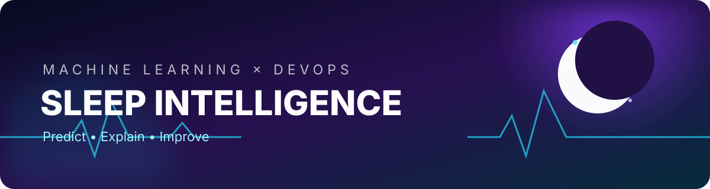
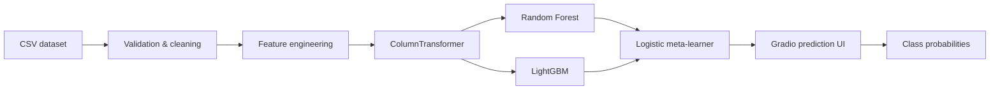

<div align="center">
  

  # 🌙 Sleep Intelligence Lab

  **An explainable machine-learning workspace for predicting sleep disorders from lifestyle and biometric signals.**

  [](https://github.com/rifat-binreza/sleep_data_analysis_bracu/actions/workflows/ci.yml)
  [](https://python.org)
  [](https://gradio.app)
  [](Dockerfile)
  [](LICENSE)

  [Quick start](#-quick-start) · [Architecture](#-architecture) · [DevOps](#-devops-toolchain) · [Author](#-author)
</div>

---

## ✨ What this project does

Sleep Intelligence Lab turns a compact health and lifestyle dataset into an interactive prediction experience. It cleans biometric data, engineers clinically meaningful signals, and trains a stacking ensemble to classify **Insomnia**, **Sleep Apnea**, or **No Disorder**.

- 🧠 **Stacked ensemble** — Random Forest + LightGBM, blended by Logistic Regression
- 🧬 **Feature engineering** — blood-pressure parsing, BMI risk, age bands, sleep efficiency, and stress/activity balance
- ⚡ **Interactive inference** — responsive Gradio controls generated directly from dataset metadata
- 📦 **Reproducible delivery** — pinned dependencies, Docker image, health check, and Make targets
- 🔁 **Continuous integration** — automated syntax, lint, and test gates on every push and pull request
- 📓 **Research included** — notebooks document experiments with voting, stacking, XGBoost, SHAP, and LIME

## 📊 Data snapshot

The included dataset contains lifestyle and health measurements such as sleep duration, quality of sleep, physical activity, stress, BMI category, blood pressure, heart rate, and daily steps. The app treats `Sleep Disorder` as its prediction target.

> This project is for education and research—not medical diagnosis. Consult a qualified healthcare professional for medical advice.

## 🏗 Architecture



## 🚀 Quick start

### Local development

```bash
git clone https://github.com/rifat-binreza/sleep_data_analysis_bracu.git
cd sleep_data_analysis_bracu
python -m venv .venv
source .venv/bin/activate       # Windows: .venv\Scripts\activate
pip install -r requirements.txt
python app.py
```

Open `http://localhost:7860`.

### Docker

```bash
docker build -t sleep-intelligence .
docker run --rm -p 7860:7860 sleep-intelligence
```

Or use the shortcuts:

```bash
make install   # install dependencies
make test      # run automated checks
make run       # launch the app
make docker    # build the container
```

## 🗂 Project map

```text
├── app.py                         # preprocessing, model, inference, and UI
├── tests/                         # deterministic preprocessing tests
├── .github/workflows/ci.yml       # CI quality gate
├── Dockerfile                     # production container
├── requirements.txt               # reproducible Python environment
├── Sleep_health_...csv            # source dataset
└── *.ipynb                        # research and model experiments
```

## ♾️ DevOps toolchain

| Stage | Tooling | Outcome |
|---|---|---|
| Develop | Python, notebooks, Make | Fast and repeatable local workflow |
| Validate | Ruff, compileall, pytest | Style, syntax, and behavior checks |
| Build | Docker | Portable runtime artifact |
| Integrate | GitHub Actions | Automated checks on pushes and PRs |
| Operate | Container health check | Runtime readiness visibility |

### Runtime configuration

| Variable | Default | Description |
|---|---:|---|
| `HOST` | `0.0.0.0` | Interface used by the web server |
| `PORT` | `7860` | HTTP port |
| `GRADIO_SHARE` | `false` | Enable a temporary Gradio public link |

## 🔬 Model notes

Categorical values are one-hot encoded and numerical values are standardized inside a scikit-learn pipeline. Keeping transforms in the pipeline prevents training/serving skew. The stack uses stratified cross-validation for out-of-fold base-model predictions and a logistic meta-learner for the final class estimate.

## 🤝 Contributing

1. Create a focused branch.
2. Add or update tests with your change.
3. Run `make test`.
4. Open a pull request with a clear description and evidence.

## 👨‍💻 Author

Built and maintained by **[rifat-binreza](https://github.com/rifat-binreza)**.

If this project helped you, leave a ⭐—it helps others discover the work.

## 📄 License

Released under the [MIT License](LICENSE).
